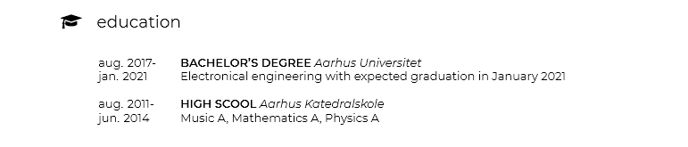

# Specialised CV class for LaTeX

This project contains a class specially made for typesetting CV's in LaTeX. This project is inspired by [Roald87's CV 
class](https://github.com/Roald87/xelatex-cv-roald) but is designed to be more simplistic in the layout.

## Getting started

Clone this repository and do one of two things:
1. acquire a distribution of LaTeX (for instance [TeXLive](https://www.tug.org/texlive/)).
1. use [Overleaf](www.overleaf.com) instead

If you use a local distribution of LaTeX, you can simply change the contents in the `main.tex` file to reflect your own achievements.
If you use Overleaf or similar you can compress the entire project and upload it and change the `main.tex` file from there.

Whether you decide to go with the local distribution or an online editor, this project is to be compiled with XeLaTeX. You can change this setting in 
Overleaf from the project settings menu.

## Class options

The allowed options for the document class are as follows.

| Option               |   Description              |
| --------------------	| ----------------------    |
| `name={<NAME>}` 	    |	Name of the subject 	|
| `phone={<PHONE NUMBER>}` |        Phone number |
|   `linkedin`            |   If options is parsed, place a linkedin symbol WITHOUT hyperref in header |
| `linkedinlink={<LINKEDIN URL>}`| Use this option to link to linkedin using hyperref. Use only one of the linkedin options or they will conflict | 
|`github={<GITHUB USERNAME>}` |    If option is parsed, place a GitHub symbol in header |
| `address={<FULL ADDRESS>}`|      Full address of the subject, including city and postal code| 
| `mail={<EMAIL ADDRESS}`  | E-mail address of the subject |

## Macros

### `\maketitle`

This class features a redefinition of this command. Use this command to print the header of the page and pass the parameters directly to the `\documentclass` command

### `\makepicture`

Use this command to include a picture in the top-right corner of the document. The command takes one argument, the path of the image.

`\makepicture{<imagepath>}`

### `\section{}`

The class presents changes to the existing `\section{}` command. You can now pass an optional paramter to this command to produce a `fontawesome` icon. You can view the entire list of icons from the [fontawesome documentation here](ftp://ftp.di.uminho.pt/pub/ctan/fonts/fontawesome/doc/fontawesome.pdf). The syntax is

`\section[icon=<name of icon>]{<section name>}`

### `cvtab` environment

`cvtab` is a longtable-based environment with 2 columns. The width of the left column can be set with `\setlength{\leftcolumnwidth}{<width>}`. The right column is per default calculated from the width of the left column but this can be changed with `\setlength{\rightcolumnwidth}{<width>}`.

It is advised to use the [`\cvpoint` command](#`cvpoint`-command) for items that have a start and end date. Otherwise use the following syntax:

```latex
\section[icon=globe]{Language skills}

\begin{cvtab}
    & \textbf{Danish}\newline Native language\\
    & \textbf{English}\newline Fluent
\end{cvtab}
```

This will produce the following:


The leftmost ampersands are there to bypass the left column which is used to indicate start and end dates

### `\cvpoint` command

The `\cvpoint` command is the recommended way of entering items like education, work experience and so forth. The command takes 5 arguments.

| Number of parameter | Name        | Description                            |
|---------------------|-------------|----------------------------------------|
| 1                   | From        | The starting date of this item         |
| 2                   | To          | The ending date of this item           |
| 3                   | Title       | The work title or degree of education  |
| 4                   | Place       | The place of work or education         |
| 5                   | Description | A description of the work or education |

An example is shown below.

```latex
\section[icon=graduation-cap]{Education}

\begin{cvtab}
    \cvpoint{aug. 2017}{jan. 2021}{Bachelor's degree}{Aarhus Universitet}{Electronical engineering with expected graduation in January 2021}\\
    \cvpoint{aug. 2011}{jun. 2014}{High scool}{Aarhus Katedralskole}{Music A, Mathematics A, Physics A}
\end{cvtab}
```

As with a regular row in a tabular environment in `LaTeX` one must terminate the row with `\\`. The example above produces the result below.



## Fonts

The fonts can be changed by the user. I've added a few styles of the two fonts used in the [Fonts/ folder](Fonts/), and they can be changed by editing the font specification in the Fonts section of the [customCV.cls file](customCV.cls). For more information check out the [fontspec documentation](http://mirrors.up.pt/pub/CTAN/macros/latex/contrib/fontspec/fontspec.pdf).

## Attribution

As mentioned, I have taken inspiration from [Roald87's CV 
class](https://github.com/Roald87/xelatex-cv-roald). Check it out - it is also a pretty neat class for typesetting your CV in `LaTeX`.